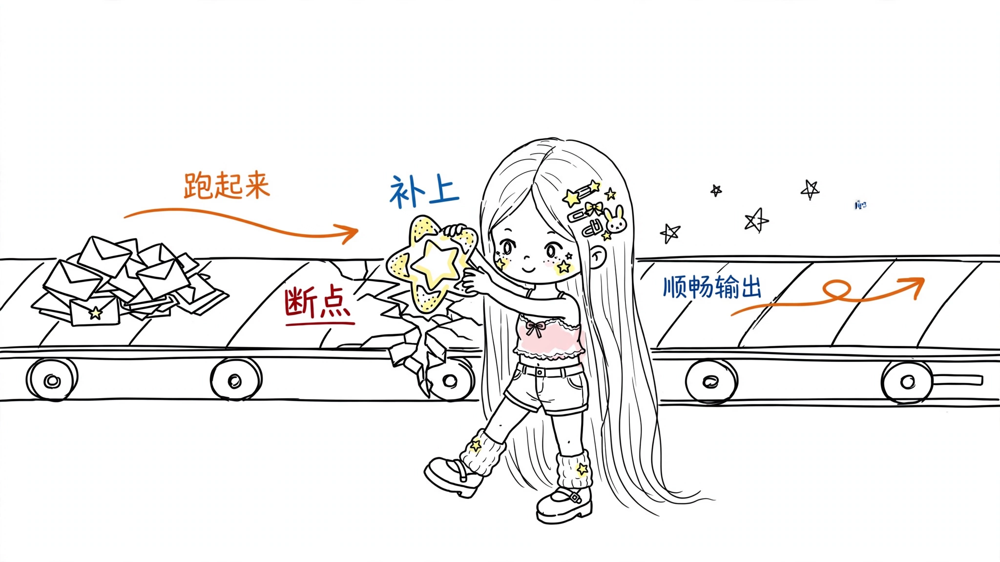
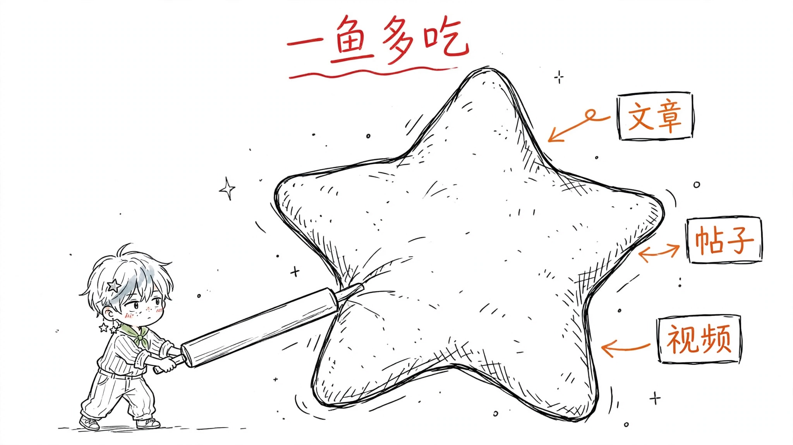
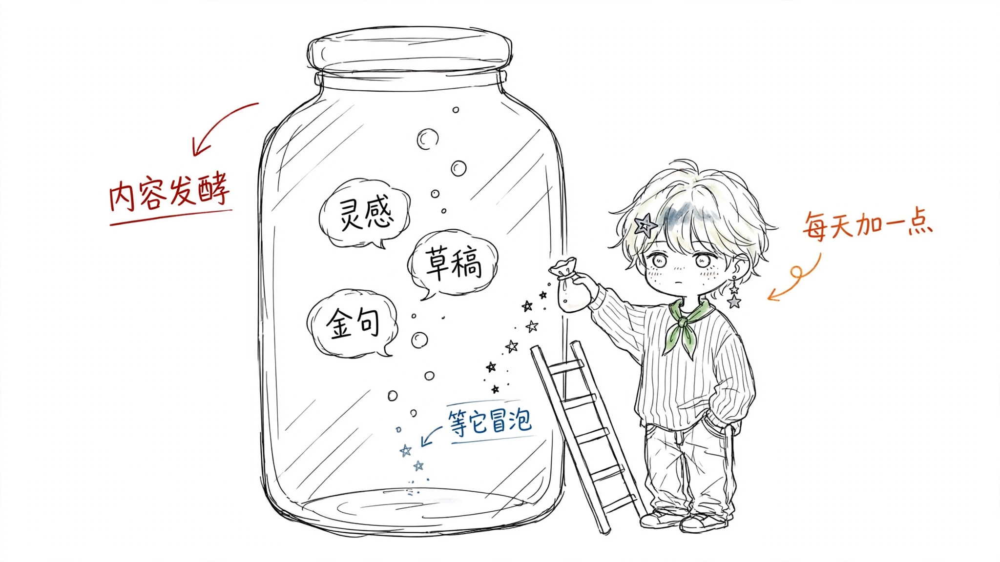

# Muse AI Party Illustrations

> 把中文文章里的判断、流程、状态和隐喻，变成一张张白底手绘的小星正文配图。

> 16:9 横版 | 小星（Xing）IP | 纯白手绘 | 少量红橙蓝中文批注 | Codex Skill

---

## 这个仓库是什么？

Muse AI Party Illustrations 是一个 Codex Skill，指导 AI Agent 为中文文章、帖子、博客、Notion 文档和方法论内容生成正文配图。

它不是通用插画 prompt，也不是 PPT 信息图模板。它的核心目标是：先理解文章里的认知锚点，再把其中一个判断、流程、结构、状态或隐喻，变成一张有记忆点的 16:9 手绘解释图。

默认视觉 IP 是"小星（Xing）"：浅金短碎发、蓝灰挑染、星星发夹配星星耳坠、条纹衬衫加绿领巾，脸上没什么表情的小酷仔。小星不是贴纸装饰，而是正在认真干活的荒诞执行者——酷是他的样子，荒诞是他的处境。

一句话：**让 AI 不只是"配一张图"，而是让小星把文章里的一个关键认知动作做出来。**

---

## 适合谁用

特别适合：

- 写中文文章，需要正文配图和文章插图的人
- 做知识型内容、方法论内容、AI 工作流内容的人
- 想把抽象判断画成具体隐喻的人
- 想要一种比 PPT 信息图更轻、更甜、更有个人识别度的配图风格的人
- 想围绕一个固定 IP 形象做内容视觉的人
- 用 Codex 做内容生产，希望稳定复用一套视觉语言的人

不适合：

- 想要暗黑、极简线稿、恐怖谷风格的人
- 想要传统 PPT 信息图、复杂架构图或流程图的人
- 想要商业插画、品牌 KV 或正式图表的人
- 想把大量正文、长段解释或完整课程页塞进一张图里的人
- 需要严格可编辑矢量源文件的人

---

## 它会产出什么

默认输出：

- 16:9 横版正文配图
- 一篇文章的 4-8 张 shot list
- 每张图的主题、核心意思、结构类型、小星动作和中文标注建议
- 最终 PNG 图片，保存到 workspace 的 `assets/<article-slug>-illustrations/`

默认不输出：

- PPTX / PDF / Keynote
- SVG / HTML / Canvas 可编辑图
- 商业海报或封面 KV
- 大段文字型信息图

---

## 视觉风格

这个 skill 默认使用"小星手绘白底"风格：

- 纯白背景，不要纸纹、米色、阴影、渐变
- 黑色手绘线稿，细线，轻微抖动
- 小星以手绘小小形象出现（占画面高度 ≤1/3）：短碎发＋蓝灰挑染、星星发夹、星星耳坠、条纹衬衫＋绿领巾、阔腿牛仔裤，全部线稿勾形；淡绿仅点缀领巾，淡蓝灰仅点缀挑染
- 大量留白，主体（含小星与物件）只占画面约 40%-60%
- 少量红橙蓝中文手写批注
- 一张图只表达一个核心动作、结构、状态或隐喻
- 小星必须亲手执行核心动作，不能只是装饰
- 记忆点来自"小小的人 vs 巨型物件"的体型反差

---

## 示例效果

### 补上断点



### 一鱼多吃



### 信任桥


### 内容发酵



这些图片是风格校准样例，不是构图模板。使用时应该从当前文章重新发明隐喻，不要照抄旧案例的物件和构图。

---

## 安装

克隆仓库：

```
git clone https://github.com/liaoyio/muse-aiparty-illustrations.git
cd muse-aiparty-illustrations
```

复制 skill 到 Codex skills 目录：

```
mkdir -p "${CODEX_HOME:-$HOME/.codex}/skills"
cp -R ./muse-aiparty-illustrations "${CODEX_HOME:-$HOME/.codex}/skills/"
```

安装后，在 Codex 里使用：

```
Use $muse-aiparty-illustrations 为这篇中文文章设计并生成 5 张小星正文配图。
```

---

## 怎么用

### 只做配图规划

```text
Use $muse-aiparty-illustrations 先不要生图。
请分析下面这篇文章哪里值得配图，输出 5 张左右的 shot list。
每张图写清楚：放在哪段后、主题、核心意思、结构类型、小星在做什么、建议中文标注词。

<粘贴文章>
```

### 直接生成正文配图

```text
Use $muse-aiparty-illustrations 把下面这篇文章生成 4 张小星正文配图。
要求：16:9 横版、纯白背景、黑色手绘线稿、少量红橙蓝中文手写批注。
每张图只讲一个核心结构，不要做 PPT 信息图。

<粘贴文章>
```

### 为单个概念生成一张图

```text
Use $muse-aiparty-illustrations 为"信任不是喊出来的，而是一块证据一块证据铺过去"生成一张正文配图。
画面要酷但有反差感，小星必须亲手执行核心动作。
中文标注最多 5 个，短一点。
```

### 修正形象走样

```text
Use $muse-aiparty-illustrations 这张图里小星的星星发夹画错了，
请对照基准图局部修正，其他内容保持不变。
```

更多示例见 `examples/prompts.md`。

---

## 工作流程

这个 skill 的流程是：

1. 读取文章、Markdown、Notion 内容、截图或用户给的主题
2. 提炼核心观点、认知转折、流程结构和适合视觉化的段落
3. 先输出 shot list：每张图只选一个认知锚点
4. 为每张图选择结构类型
5. 重新发明一个怪诞但成立的物理隐喻，善用"小小的人 vs 巨型物件"的体型反差
6. 让小星亲手执行核心动作
7. 每张图单独调用图像模型生成（附两张基准图作设计参考＋CHARACTER LOCK 原文）
8. 按 QA checklist 检查：先验脸，再验动作，最后验结构
9. 保存最终 PNG，并报告用途和路径

---

## 目录结构

```
.
├── README.md
├── LICENSE
├── NOTICE.md
├── CHANGELOG.md
├── examples/
│   ├── images/                  # 小星新示例（风格校准）
│   ├── archive-xiaohei/         # 旧小黑示例归档（历史参考）
│   └── prompts.md
└── muse-aiparty-illustrations/  # ← 安装到 Codex 的是这个子目录
    ├── SKILL.md
    ├── agents/
    │   └── openai.yaml
    ├── assets/
    │   ├── examples/            # 小星新示例（skill 内校准集）
    │   └── archive-xiaohei/     # 旧小黑示例归档
    └── references/
        ├── ip-character.md      # 小星角色圣经 + CHARACTER LOCK
        ├── character/           # 基准图（全身正脸版 / 脸部特写验脸锚点）
        ├── style-dna.md
        ├── composition-patterns.md
        ├── prompt-template.md
        └── qa-checklist.md
```

真正需要安装到 Codex 的是子目录：

```
muse-aiparty-illustrations/
```

根目录的 README、LICENSE、NOTICE、CHANGELOG 和 examples 是 GitHub 分享文档。

---

## 注意事项

- 图片里的中文文字越短越稳定。
- 每张图只讲一个核心结构，不要把文章做成说明书。
- 小星必须亲手执行核心动作；如果去掉小星画面仍然完全成立，说明他太装饰了。
- 生图务必复用 CHARACTER LOCK（手绘版）原文，并附上两张基准图（仅取设计元素）；小星必须画成手绘小小形象，禁 3D / 写实渲染。
- 示例图只用于校准线条、留白、颜色克制和小星气质，不要复刻构图。
- AI 图像模型可能出现错字、幻觉标签、风格漂移或形象走样，生成后必须先验脸再验其他。
- 换主题服装时，脸、短发＋挑染、星星发夹、星星耳坠四项不许动，只换衣服。

---

## 来源与署名

本仓库 fork 自 [helloianneo/ian-xiaohei-illustrations](https://github.com/helloianneo/ian-xiaohei-illustrations)（MIT License），原作者 Ian。Fork 后角色、风格、提示词与示例已全部替换为原创 IP 小星（Xing）与手绘白底视觉体系。根据原 NOTICE 要求，在此保留对原作者的署名。

---

## 关于作者

**Yi** — AI Builder，用 AI 团队打造一人公司。

- GitHub: [liaoyio](https://github.com/liaoyio)

---

## License

MIT License. See [LICENSE](LICENSE).
